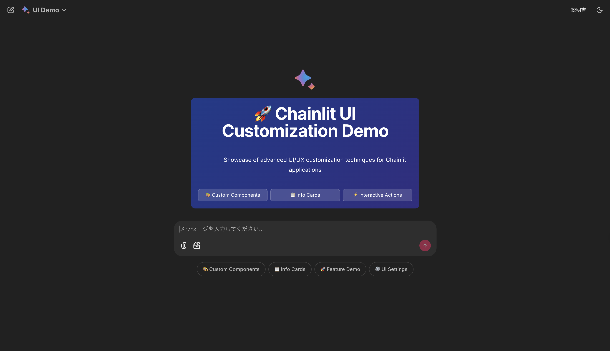
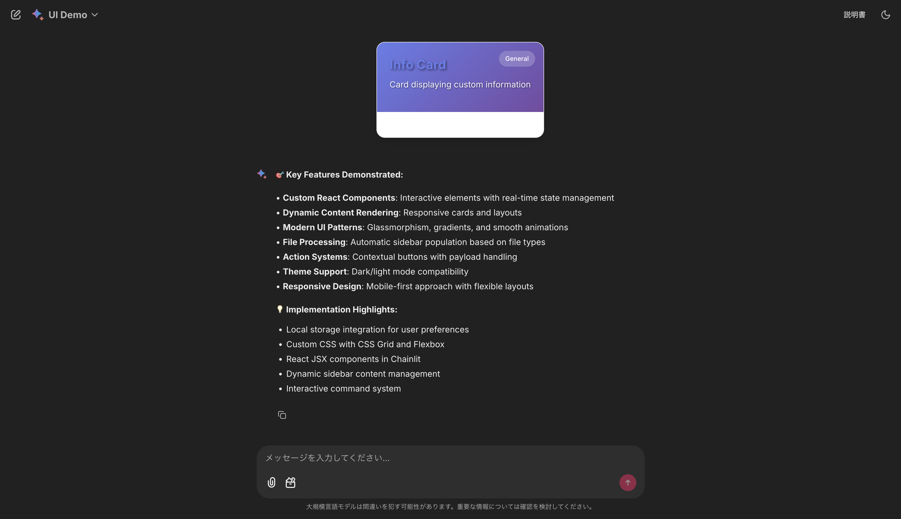
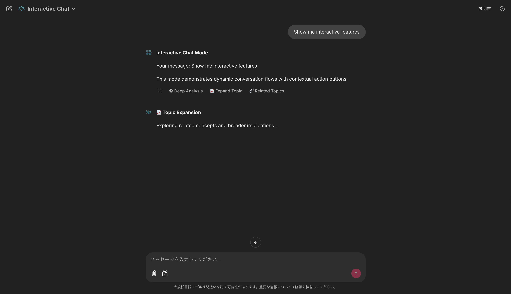
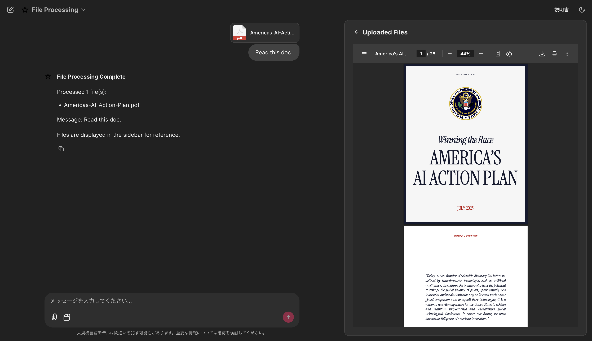
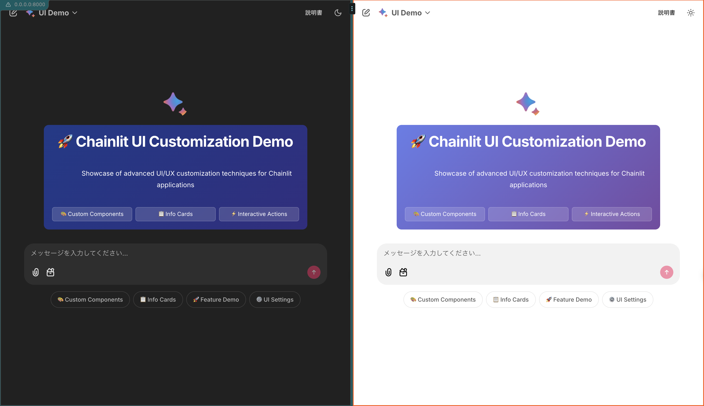

<div align="center">

# 🚀 Chainlit UI Customization Demo

<p align="center">
  <strong>A comprehensive showcase of advanced UI/UX customization techniques for modern Chainlit applications</strong>
</p>

<p align="center">
  
  
  
  
</p>

<p align="center">
  
  
  
  
</p>

<p align="center">
  <a href="#-features">Features</a> •
  <a href="#-quick-start">Quick Start</a> •
  <a href="#-demo">Demo</a> •
  <a href="#-customization">Customization</a> •
  <a href="#-contributing">Contributing</a>
</p>



> ✨ **Transform your Chainlit applications with stunning UI customizations, interactive components, and modern web design patterns**

</div>

---

## 🌟 Features

<table>
<tr>
<td width="50%">

### 🎯 **Chat Profiles**
- 🎨 **UI Demo** - Interactive components showcase
- 💬 **Interactive Chat** - Dynamic conversation flows
- 📁 **File Processing** - Smart file handling

### 🧩 **Custom Components** 
- ⚛️ React/JSX integration
- 💾 Local storage persistence  
- 🌈 Glassmorphism effects
- 📱 Mobile-responsive design

</td>
<td width="50%">

### ⚡ **Advanced Features**
- 🌓 Dark/Light theme support
- 🎬 Smooth animations & transitions
- 🔧 Interactive action buttons
- 📤 Drag & drop file uploads

### 🛠️ **Developer Experience**
- 🚀 Modern CSS techniques
- 📋 Slash command system
- 🎛️ Live UI configuration
- 📊 Structured data display

</td>
</tr>
</table>

<div align="center">

### 🏆 **What Makes This Special?**

| Feature | Description | Status |
|---------|-------------|--------|
| 🎨 **UI Customization** | Glassmorphism, gradients, animations | ✅ Ready |
| ⚛️ **React Integration** | Custom JSX components with state management | ✅ Ready |
| 📱 **Responsive Design** | Mobile-first, flexible layouts | ✅ Ready |
| 🔧 **Interactive Actions** | Dynamic buttons with follow-up capabilities | ✅ Ready |
| 📁 **File Processing** | Multi-format support with sidebar display | ✅ Ready |
| 🌓 **Theme System** | Dark/Light mode with CSS variables | ✅ Ready |
| 💾 **Data Persistence** | Local storage for user preferences | ✅ Ready |
| 🚀 **Performance** | Optimized loading and smooth interactions | ✅ Ready |

</div>

## 🛠️ Tech Stack

<div align="center">

<table>
<tr>
<td align="center" width="25%">
<br>
<sub><b>Chat UI Framework</b></sub>
</td>
<td align="center" width="25%">
<br>
<sub><b>Backend Logic</b></sub>
</td>
<td align="center" width="25%">
<br>
<sub><b>Custom Components</b></sub>
</td>
<td align="center" width="25%">
<br>
<sub><b>Styling & Animations</b></sub>
</td>
</tr>
</table>

</div>

## 🚀 Quick Start

<div align="center">

### ⚡ **Get up and running in 30 seconds!**

</div>

```bash
# 📥 Clone the repository
git clone https://github.com/Beginnersguide138/chainlit-customized.git
cd chainlit-customized

# 📦 Install dependencies with uv
uv sync

# 🚀 Launch the application
uv run chainlit run main.py

# � Open in browser
# Navigate to http://localhost:8000
```

<div align="center">

🎉 **That's it!** Your customized Chainlit app is now running!

</div>

> 💡 **Pro Tip**: Use `--port 8001` if port 8000 is already in use

### 📋 **Prerequisites**

-  **Python 3.13+**
-  **uv package manager**

<details>
<summary>📦 <strong>Don't have uv installed?</strong></summary>

```bash
# Install uv (macOS/Linux)
curl -LsSf https://astral.sh/uv/install.sh | sh

# Install uv (Windows)
powershell -c "irm https://astral.sh/uv/install.ps1 | iex"

# Or via pip
pip install uv
```

</details>

## 🎯 Demo & Usage

<div align="center">

### 🎬 **Live Demo Screenshots**

<table>
<tr>
<td width="50%">

<sub><b>🎨 UI Demo - Interactive Custom Components</b></sub>
</td>
<td width="50%">

<sub><b>⚡ Interactive Chat - Dynamic Action Buttons</b></sub>
</td>
</tr>
<tr>
<td width="50%">

<sub><b>📁 File Processing - Smart Upload & Display</b></sub>
</td>
<td width="50%">

<sub><b>🌓 Theme System - Dark/Light Mode Support</b></sub>
</td>
</tr>
</table>

*Experience the power of customized Chainlit interfaces with modern UI patterns*

</div>

### 🎮 **Interactive Playground**

<table>
<tr>
<td width="33%">

#### 🎨 **UI Demo Profile**
```
🎨 → Custom Components
📋 → Info Cards  
🔧 → Full Demo
⚙️ → UI Settings
```

<div align="center">

</div>

</td>
<td width="33%">

#### 💬 **Interactive Chat**
```
⚡ → Dynamic Actions
🔗 → Follow-up Messages
🎭 → Context Awareness
🎯 → Smart Responses
```

<div align="center">

</div>

</td>
<td width="33%">

#### 📁 **File Processing**
```
📤 → Drag & Drop Upload
🖼️ → Image Display
📄 → PDF Viewer
📊 → Data Processing
```

<div align="center">

</div>

</td>
</tr>
</table>

<div align="center">

### 🎯 **Quick Actions**

| Command | Action | Result |
|---------|--------|--------|
| `🎨` | Show Components | Interactive prompt management |
| `📋` | Display Cards | Structured data with modern styling |
| `demo` | Full Showcase | Complete feature demonstration |
| `⚙️` | UI Settings | Configuration panel |
| **File Drop** | Upload | Automatic sidebar rendering |

</div>

### 🛠️ **Development Commands**

```bash
# 🚀 Standard launch
uv run chainlit run main.py

# 🔧 Custom port
uv run chainlit run main.py --port 8001

# 🌐 Network access
uv run chainlit run main.py --host 0.0.0.0

# 🔍 Debug mode
uv run chainlit run main.py -w
```

## 🎨 Implementation Highlights

### Custom React Components

```jsx
// Interactive prompt management
<CustomElement 
  name="CustomPromptsList" 
  props={{
    data: prompts_data,
    editable: true
  }} 
/>

// Structured info cards
<CustomElement 
  name="InfoCards" 
  props={{data: info_data}} 
/>
```

### Modern CSS Techniques

```css
/* Glassmorphism effects */
.glassmorphism {
  background: rgba(255, 255, 255, 0.1);
  backdrop-filter: blur(10px);
  border: 1px solid rgba(255, 255, 255, 0.2);
  border-radius: 12px;
}

/* CSS Grid layouts */
.features-grid {
  display: grid;
  grid-template-columns: repeat(auto-fit, minmax(200px, 1fr));
  gap: 1rem;
}

/* Theme support */
[data-theme="dark"] {
  --bg-color: #1f2937;
  --text-color: #f9fafb;
}
```

### Dynamic File Processing

```python
# Automatic sidebar population
async def handle_file_processing(message: cl.Message):
    files = message.elements or []
    sidebar_elements = []
    
    for file in files:
        if file.mime and file.mime.startswith('image/'):
            sidebar_elements.append(cl.Image(name=file.name, path=file.path))
        elif file.mime == 'application/pdf':
            sidebar_elements.append(cl.Pdf(name=file.name, path=file.path))
        # ... additional file type handling
    
    await cl.ElementSidebar.set_elements(sidebar_elements)
```

### Interactive Action Systems

```python
# Dynamic action buttons with follow-up capabilities
actions = [
    cl.Action(name="action_summary", label="📝 Create Summary", payload={"action": "summary"}),
    cl.Action(name="action_detail", label="🔍 Show Details", payload={"action": "detail"}),
    cl.Action(name="action_demo", label="⭐ Full Demo", payload={"action": "demo"}),
]

await cl.Message(content=response, actions=actions).send()
```

## 📁 Project Architecture

<div align="center">

### 🏗️ **Clean & Organized Structure**

</div>

```
🚀 chainlit-customized/
│
├── 🐍 main.py                          # 🎯 Core application logic & chat profiles
├── ⚙️ config_editor.py                 # 🎛️ UI configuration management  
├── 📝 chainlit.md                      # 🏠 Welcome page content
├── 📦 pyproject.toml                   # 📋 Dependencies & project config
├── 🔐 auth_system.py                   # 🔑 User authentication & sessions
├── 🧠 memory_manager.py                # 💾 Conversation memory & context
│
└── 🌐 public/                          # 📁 Frontend assets & components
    │
    ├── 🧩 elements/                    # ⚛️ Custom React components
    │   ├── 🎨 CustomPrompts.jsx        # 📝 Interactive prompt management
    │   ├── 📋 CustomPromptsList.jsx    # ✏️ Editable prompt collections
    │   ├── 📊 InfoCards.jsx            # 🃏 Structured data display
    │   └── ⭐ StarfieldBackground.jsx  # 🌟 Animated visual effects
    │
    ├── 📸 images/screenshots/          # 🖼️ Demo screenshots & visuals
    │   ├── 🏠 welcome-page.png         # 🎯 Main landing page
    │   ├── 🎨 ui-demo-active.png       # 🧩 Interactive components demo
    │   ├── ⚡ interactive-chat.png     # 💬 Action buttons showcase
    │   ├── 📁 file-processing.png      # 📤 File upload & processing
    │   └── 🌓 theme-comparison.png     # 🎭 Dark/Light theme comparison
    │
    ├── 🎨 styles.css                   # 🌈 Global styling & theme system
    └── 🔧 themeToggle.js              # 🌓 Dynamic theme switching
```

<div align="center">

### 📊 **File Overview**

| Type | Count | Purpose |
|------|-------|---------|
| 🐍 **Python** | 4 files | Backend logic, auth, memory |
| ⚛️ **React/JSX** | 4 files | Interactive UI components |
| 🎨 **CSS/JS** | 2 files | Styling & client-side logic |
| 📝 **Config** | 3 files | Project setup & documentation |

</div>

## 🔧 Customization Examples

### Adding New Chat Profiles

```python
new_profile = cl.ChatProfile(
    name="Custom Assistant",
    markdown_description="Your custom assistant description",
    icon="https://example.com/icon.png",
    starters=[
        cl.Starter(
            label="Quick Start",
            message="Hello! How can I help you today?"
        )
    ]
)
```

### Creating Custom React Components

```jsx
// Create new component in public/elements/
function CustomWidget({data}) {
    const [state, setState] = useState(data);
    
    return (
        <div className="custom-widget">
            <h3>{data.title}</h3>
            <div className="widget-content">
                {/* Your custom content */}
            </div>
        </div>
    );
}
```

### Adding Action Callbacks

```python
@cl.action_callback("action_custom")
async def on_action_custom(action):
    payload = action.payload
    # Process the action
    
    follow_up_actions = [
        cl.Action(name="action_follow_up", label="Continue", payload={"next": "step"})
    ]
    
    await cl.Message(
        content="Action processed successfully!",
        actions=follow_up_actions
    ).send()
```

### CSS Theme Customization

```css
/* Light theme */
:root {
  --primary-color: #667eea;
  --secondary-color: #764ba2;
  --surface-color: #ffffff;
  --text-color: #1f2937;
  --border-color: #e5e7eb;
}

/* Dark theme */
[data-theme="dark"] {
  --primary-color: #4f46e5;
  --secondary-color: #7c3aed;
  --surface-color: #1f2937;
  --text-color: #f9fafb;
  --border-color: #374151;
}
```

## � Demo Scenarios

### 1. UI Customization Showcase
- Modern glassmorphism effects
- Smooth animations and transitions
- Responsive grid layouts
- Interactive hover states

### 2. Component Interaction
- Editable prompt management
- Local storage persistence
- Real-time state updates
- Category-based organization

### 3. File Processing Workflow
- Drag & drop file upload
- Automatic MIME type detection
- Dynamic sidebar rendering
- Multi-format support

### 4. Action-Based Conversations
- Contextual button generation
- Follow-up message flows
- Payload-based routing
- Dynamic content updates

## 🚀 Advanced Features

### Local Storage Integration
- **Persistent Preferences**: User customizations saved across sessions
- **Custom Prompts**: Editable and persistent prompt collections
- **Theme Selection**: Automatic theme preference storage

### Modern CSS Techniques
- **CSS Grid & Flexbox**: Responsive layout systems
- **Custom Properties**: Theme-aware color systems
- **Backdrop Filters**: Glassmorphism visual effects
- **CSS Animations**: Smooth transitions and micro-interactions

### React Component System
- **State Management**: Local state with hooks
- **Event Handling**: Interactive user experiences
- **Props Interface**: Dynamic data binding
- **Lifecycle Management**: Efficient rendering patterns

## 🛠️ Development Guidelines

### File Organization
- **Components**: Place React components in `public/elements/`
- **Styles**: Use CSS variables for theme consistency
- **Logic**: Keep business logic in Python files
- **Assets**: Store static files in `public/` directory

### Best Practices
- **Responsive First**: Design for mobile, enhance for desktop
- **Performance**: Optimize for fast loading and smooth interactions
- **Accessibility**: Ensure keyboard navigation and screen reader support
- **Theme Support**: Use CSS variables for consistent theming

### Troubleshooting
- **Port Conflicts**: Use `--port 8001` flag if default port is occupied
- **Dependency Issues**: Run `uv sync` to reinstall dependencies
- **Component Errors**: Check browser console for React/JSX syntax errors
- **Style Issues**: Verify CSS variable names and theme selectors

## 🤝 Contributing

<div align="center">

### 🚀 **Join the Community!**

We welcome contributions that enhance the educational value and showcase new UI/UX possibilities!

[](https://github.com/Beginnersguide138/chainlit-customized/graphs/contributors)

</div>

### 💡 **Enhancement Areas**

<table>
<tr>
<td width="50%">

#### 🎨 **UI/UX Improvements**
- [ ] New interaction patterns
- [ ] Advanced animations
- [ ] Component libraries
- [ ] Design system patterns

#### 📱 **Experience Enhancements**  
- [ ] Mobile optimizations
- [ ] Accessibility features
- [ ] Performance improvements
- [ ] Browser compatibility

</td>
<td width="50%">

#### 🔧 **Technical Features**
- [ ] New React components
- [ ] CSS methodology examples
- [ ] Integration patterns
- [ ] Developer tools

#### 📚 **Documentation**
- [ ] Tutorial improvements
- [ ] Code examples
- [ ] Best practices
- [ ] Video guides

</td>
</tr>
</table>

### 🛠️ **Development Workflow**

```bash
# 1️⃣ Fork & Clone
git clone https://github.com/your-username/chainlit-customized.git

# 2️⃣ Create Feature Branch
git checkout -b feature/amazing-new-component

# 3️⃣ Develop & Test
uv run chainlit run main.py --debug

# 4️⃣ Submit PR with examples
git push origin feature/amazing-new-component
```

<div align="center">

**🎯 Quality Guidelines:** Ensure mobile responsiveness, document your changes, and include usage examples!

</div>

---

## 📚 Resources & Learning

<div align="center">

### 🎓 **Master Chainlit Customization**

</div>

<table>
<tr>
<td width="33%">

#### 📖 **Official Docs**
- [Chainlit Documentation](https://docs.chainlit.io/)
- [Custom Elements](https://docs.chainlit.io/concepts/element)
- [Chat Profiles](https://docs.chainlit.io/concepts/chat-profile)
- [Authentication](https://docs.chainlit.io/authentication)

</td>
<td width="33%">

#### 🎨 **Frontend Skills**
- [Modern CSS](https://web.dev/learn/css/)
- [React Hooks](https://react.dev/reference/react)
- [Responsive Design](https://web.dev/responsive-web-design-basics/)
- [CSS Grid](https://css-tricks.com/snippets/css/complete-guide-grid/)

</td>
<td width="33%">

#### � **Development Tools**
- [uv Package Manager](https://docs.astral.sh/uv/)
- [Python Type Hints](https://docs.python.org/3/library/typing.html)
- [Browser DevTools](https://developer.chrome.com/docs/devtools/)
- [Git Workflow](https://www.atlassian.com/git/tutorials)

</td>
</tr>
</table>

---

## 📜 License & Acknowledgments

<div align="center">

### 📝 **MIT License**

This project is open source and available under the [MIT License](LICENSE).

### 🌟 **Special Thanks**

<table>
<tr>
<td align="center">
<br>
<sub><b>Chainlit Team</b></sub><br>
<sub>🚀 Amazing framework</sub>
</td>
<td align="center">
<br>
<sub><b>React Community</b></sub><br>
<sub>⚛️ Component patterns</sub>
</td>
<td align="center">
<br>
<sub><b>Web Standards</b></sub><br>
<sub>🌐 Modern CSS techniques</sub>
</td>
</tr>
</table>

---

<div align="center">

**⭐ Star this repo if it helped you build amazing Chainlit UIs! ⭐**

<sub>Built with ❤️ for the Chainlit community</sub>

</div>

</div>

---

<div align="center">

## 🚀 **Ready to Transform Your Chainlit App?**

### [🌟 Get Started Now](http://localhost:8000) • [📖 Read the Docs](https://docs.chainlit.io/) • [💬 Join Community](https://discord.gg/chainlit)

*Elevate your Chainlit applications with stunning customizations and modern UI patterns*

</div>
